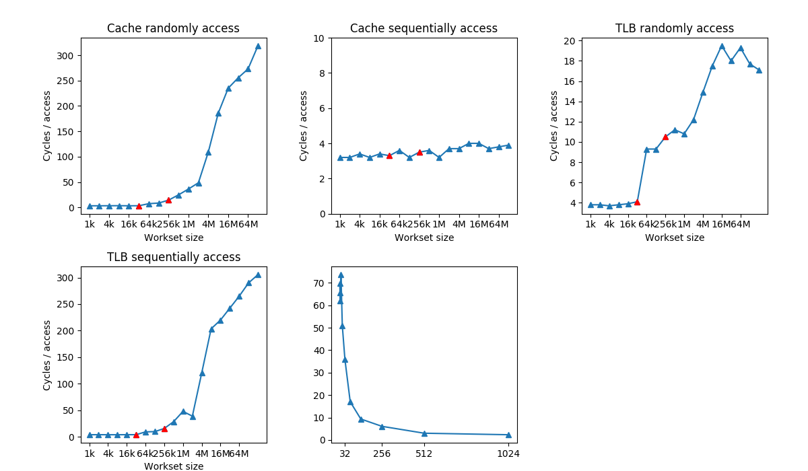

### Magic-Caches

Simple project to help me understand how cache works.

#### references:

https://www.wikiwand.com/en/CPU_cache

https://meribold.github.io/2017/10/20/survey-of-cpu-caches/#listing-1

http://igoro.com/archive/gallery-of-processor-cache-effects/
